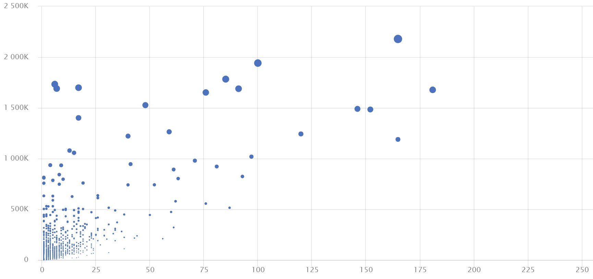
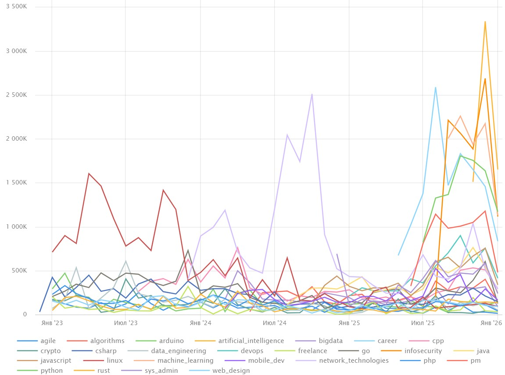

# Сравнительный анализ активности пользователей на Habr.com

**Технологии:** Python, Yandex DataLens, ETL  
**Статус:** Завершен

## О проекте
Исследовательский проект, направленный на изучение поведенческих паттернов аудитории крупнейшего IT-сообщества в России. Мы проанализировали **20 000+ статей** за 2023–2026 годы, чтобы понять:
* Кто пишет?
* Когда читают?
* Какой контент реально востребован?

---

## Методология
1. **Сбор данных:** Кастомный парсер (`requests` + `bs4`), работающий без тяжелых зависимостей.
2. **Обработка:** Потоковая запись в CSV (Clean Data).
3. **Анализ:** Визуализация в Yandex DataLens.

---

## Ключевые результаты

### 1. Профиль авторов
Платформа держится на широком слое авторов (Active Core).


### 2. Феномен "Выходного дня"
В отличие от деловых СМИ, пик активности на Хабре приходится на субботу и воскресенье.


### 3. Рейтинг тем: Польза > Хайп
Прикладные темы (Networks, Arduino) обгоняют по эффективности AI/ML.
.

### 4. Кризис формата
На графике заметны несколько аномалий, в которых можно заменить реакцию на государственные/мировые новости.


---

## Парсер

```bash
git clone [https://github.com/ВАШ_НИК/habr-analytics.git](https://github.com/TsNo0/habr-analytics.git)
pip install -r requirements.txt
python parser.py
